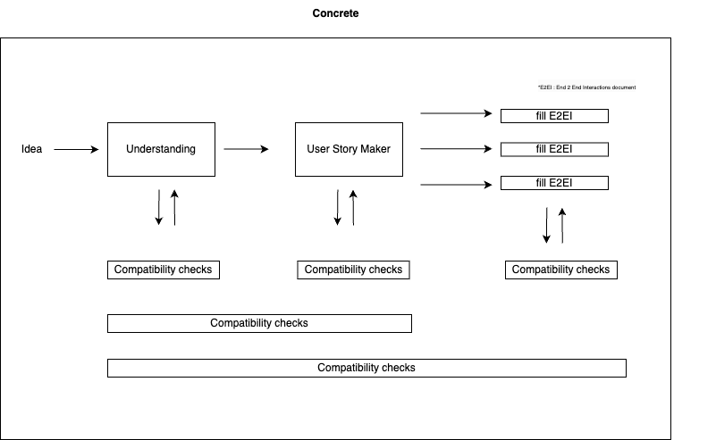
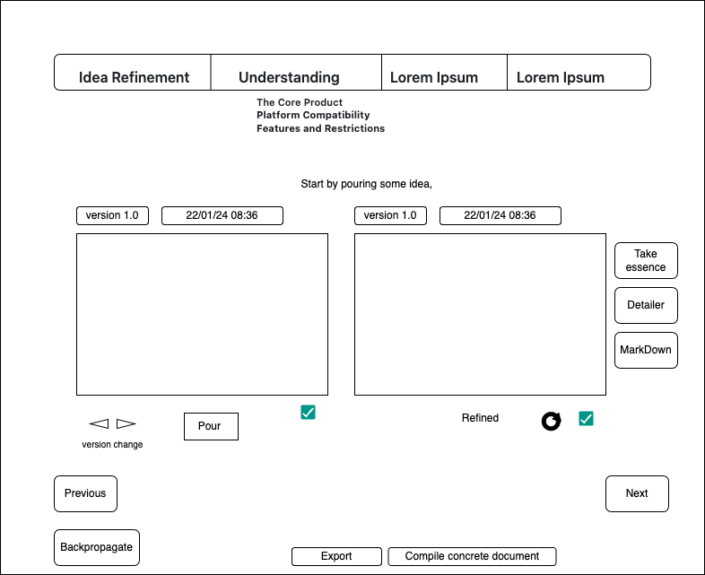

**Concrete**

Concrete is an AI-powered project definition tool designed to transform raw ideas into fully defined, meticulously written implementation-ready plans, which can then be fed back into AI for complete implementation. It aims to establish a custom-tailored documentation creation methodology specifically for AI implementations, allowing the transformation of raw concepts into detailed plans that AI can work with independently, without further user input.

- Guides users through a structured process that refines initial ideas.
- Generates both technically and use case complete comprehensive documentation.
- Organizes all relevant project information.
- Performs compatibility checks after each step and adjusts if any issues are found.
- Allows users to input and categorize notes throughout the process, ensuring thorough documentation.
- Enables AIs to act as users, fostering a collaborative environment where humans and AIs work side by side, each complementing the other's skills.

Concrete also facilitates the complete automation of idea generation and implementation, acknowledging that ideas can originate from AI as well. This creates a fully automated pipeline from concept to execution.

**What Concrete Is Not:**  
Concrete specializes in generating detailed technical documentation but does not handle the implementation itself. However, if an implementation error is encountered, it can be fed to Concrete and it can automatically refine and adjust the documentation using a backpropagation-like process.

     

**Key Features:**
1. **Idea Refinement:**
   - Users can input their initial project ideas, which are then refined by the AI to produce a clearer and more structured concept.
   
2. **Stage-Based Workflow:**
   - The project definition process is divided into stages, each containing specific substages:
     1. **Understanding:**
        - **The Core Product:** Define and refine the core concept of the project.
        - **Understanding Features and Restrictions:** Identify and refine the main features and any restrictions.
        - **Platform Compatibility:** Ensure that features are compatible with the intended platforms.
   
3. **LLM-Generated Outputs:**
   - At each substage, the AI generates refined versions of the user’s inputs, which are displayed in read-only windows for review.
   
4. **BackPropagation**

5. **Notes Management:**
   - A notes tab is available throughout the process, allowing users to take categorized notes (e.g., related to features, restrictions, platform compatibility). These notes are stored in a database and can be retrieved or reviewed later.

6. **Comprehensive Documentation:**
   - Once all stages are completed, the tool compiles all inputs and refined outputs into a final, comprehensive project document that is ready for implementation.

**Database Schema:**
- The database is structured with separate tables for each stage of the project, ensuring organized data storage. Key tables include:
  - **CoreProduct Table:** Stores core concept details.
  - **FeaturesRestrictions Table:** Stores features and restrictions.
  - **PlatformCompatibility Table:** Stores platform-related information.
  - **Notes Table:** Centralized storage for user notes, categorized by stage and substage.

**User Interaction:**
- **Step-by-Step Guidance:** Users are guided through each stage and substage, with clear instructions and input fields. The AI assists by refining user inputs at each step.
- **Note Taking:** Users can take notes at any time, with options to categorize them for easy reference.
- **Final Review:** After all stages are completed, users can review the entire project, make final adjustments, and generate a complete documentation package.

**Outcome:**
By the end of the process, users have a fully defined project with detailed technical documentation, ready to be handed over to developers for implementation. Concrete ensures that every aspect of the project is thoroughly thought out and documented, minimizing the risk of overlooked details and ensuring a smooth transition from concept to execution.
